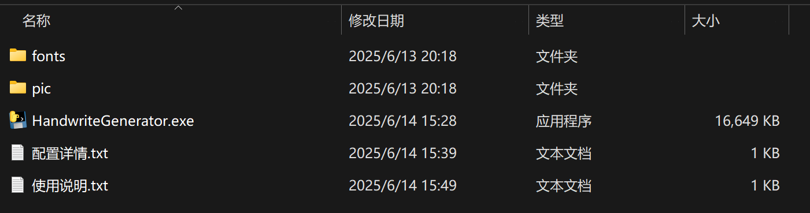

# 基于开源项目
> https://github.com/Gsllchb/Handright

# 源码结构

- main.py 和 gui.py 为项目源码
- index.py 为调试调参代码
- fonts/ 文件夹下放着项目需要的字体文件
- pic/ 文件夹下放着项目需要的图片文件

# 开箱即用
## 简单说明
> 提供开箱即用的压缩包--HandWriteGenerator.zip，压缩包内包含项目源码、字体文件、图片文件、配置文件等
解压后可直接运行exe文件
## 解压后的目录结构如下
